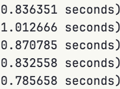
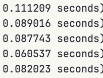

# Server

## Not pretty printing JSONs

```rocq
	Time do 13 destruct (1%nat).
```

If we pretty print the JSON for the goal state of the above the time it takes:



If we dont:



The message itself also decreases size from 27.26MB to 10.95MB.
